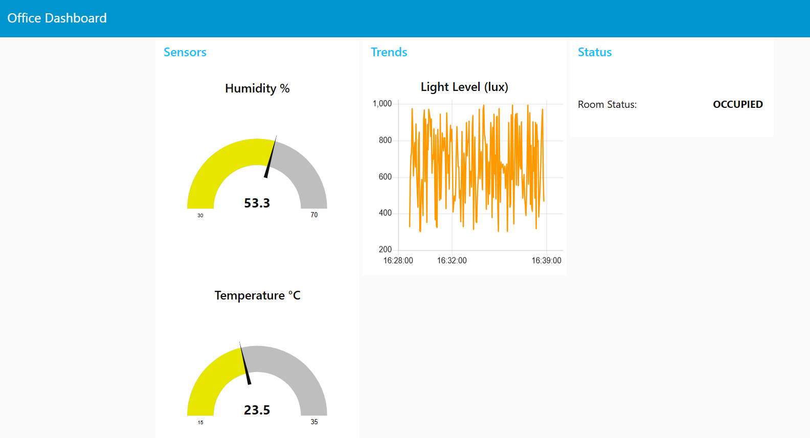

# 🚀 Industrial IoT Project

**👤 Student:** Bardia Asrari  
**📘 Course:** Industrial IoT  
**🏛️ University:** Università degli Studi di Messina  

---

## 📊 Dashboard Screenshot



---

## 🧾 Project Overview

This project demonstrates a simple **Industrial IoT (IIoT)** system that integrates:

- Sensor simulation via Python  
- MQTT-based communication  
- A Node-RED dashboard for real-time monitoring and control  
- Formal system property verification using **TLA+**

---

## 🗂️ Project Structure

Project/
├── docs/
│ ├── documentation.md # Detailed documentation
│ └── dashboard.png # Dashboard screenshot
├── node_red/
│ └── flows.json # Node-RED flow definitions
├── src/
│ └── sensor_simulator.py # Sensor simulation script
├── Verification/
│ ├── OfficeSpec.cfg # TLA+ configuration
│ ├── OfficeSpec.tla # TLA+ specification
│ └── states/ # TLC generated states
├── .gitignore
├── README.md

yaml
Copy
Edit

---

## 🛠️ Installation

Install the required dependencies:

```bash
pip install paho-mqtt
npm install -g node-red node-red-dashboard
⚙️ How to Run
1. Start MQTT Broker (Mosquitto)
bash
Copy
Edit
mosquitto -v
2. Run the Sensor Simulator
bash
Copy
Edit
python src/sensor_simulator.py
3. Start Node-RED
bash
Copy
Edit
node-red
4. Import Flows into Node-RED
Import the file node_red/flows.json into your Node-RED editor.

5. Access the Dashboard
Open your browser and navigate to:

bash
Copy
Edit
http://localhost:1880/ui
🔍 Formal Verification (TLA+)
Requirements
Java 8 or later

TLA+ Tools

Run Model Checker
bash
Copy
Edit
cd Verification
java -cp ../tla2tools.jar tlc2.TLC OfficeSpec.cfg
📄 Documentation
For detailed explanations on system architecture, components, and instructions, see:

📘 docs/documentation.md

📦 Artifacts
Sensor Simulation Code: src/sensor_simulator.py

Node-RED Flows: node_red/flows.json

TLA+ Verification Specs: Verification/

Project Documentation: docs/documentation.md

📝 Notes
Ensure all tools are correctly installed and compatible with your OS.

This project is designed for reproducibility and educational use.

For questions or issues, refer to the documentation or contact the author.

📚 References
Node-RED Documentation

Paho MQTT Python Client

TLA+ Tools
